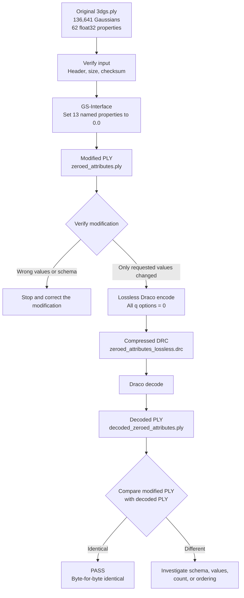

# Experiment 3B: Simplified Workflow and Conclusion

Date: 2026-07-28
Result: **PASS**

## 1. What we tested

We tested whether selected values in a 3DGS model could be changed to numeric
zero with GS-Interface and then passed through Draco without any additional
loss.

The selected properties were:

```text
x, y, z
nx, ny, nz
scale_0, scale_1, scale_2
rot_0, rot_1, rot_2, rot_3
```

We did not change:

```text
f_dc_0 through f_dc_2
f_rest_0 through f_rest_44
opacity
```

The important distinction is:

- Setting a PLY value to `0.0` changes the actual model data.
- Using a Draco quantization option such as `-qp 0` disables quantization for
  that attribute. It does not set the values to zero.

## 2. Experiment flowchart



The lossless comparison is between the **modified PLY** and the **decoded
PLY**. Comparing the decoded PLY with the original source would be incorrect
because we intentionally changed the source data before compression.

## 3. Step-by-step terminal workflow

All commands below start from the local workspace used for this experiment.

### Step 1 — Verify the original input

Terminal:

```bash
cd $REPO

pwd
git ls-files testdata/3DGS/3dgs.ply
stat -c '%n %s bytes' testdata/3DGS/3dgs.ply
sha256sum testdata/3DGS/3dgs.ply
sed -n '1,/end_header/p' testdata/3DGS/3dgs.ply
```

Why:

- Confirm that we are in the correct repository.
- Confirm that `3dgs.ply` is the tracked input.
- Record its size and SHA-256 identity.
- Inspect the PLY format, Gaussian count, and property layout.

Observed:

```text
Input: testdata/3DGS/3dgs.ply
Size: 33,888,499 bytes
SHA-256: be1e690a9e9a2543a39f7181fec0062f088221b968acd617940ff96679661a4c
Format: binary_little_endian 1.0
Gaussians: 136,641
Properties: 62 float32 properties per Gaussian
```

### Step 2 — Prepare GS-Interface

Terminal:

```bash
cd $GS_INTERFACE

python3 -m venv .venv-exp3b
.venv-exp3b/bin/python -m pip install numpy plyfile
.venv-exp3b/bin/python -c \
  "import numpy; import plyfile; print('GS-Interface dependencies available')"
```

Why:

GS-Interface requires NumPy and `plyfile`. A dedicated virtual environment
keeps these experiment dependencies separate from the system Python.

Installed:

```text
numpy 2.5.1
plyfile 1.1.4
```

### Step 3 — Change the selected properties to zero

The transformation program is:

```text
experiment_results/exp3b_zero_attributes/zero_attributes.py
```

Terminal:

```bash
cd $GS_INTERFACE

.venv-exp3b/bin/python \
  ../Draco-for-3DGS/experiment_results/exp3b_zero_attributes/zero_attributes.py \
  --input ../Draco-for-3DGS/testdata/3DGS/3dgs.ply \
  --output ../Draco-for-3DGS/experiment_results/exp3b_zero_attributes/zeroed_attributes.ply
```

Why:

Use `GaussianModelV2` from GS-Interface to:

1. load the original PLY;
2. explicitly select the 13 requested properties;
3. fill those property arrays with float32 `0.0`;
4. export a new binary PLY;
5. reload the output and verify it.

The script refuses to overwrite the original input.

Observed:

```text
Gaussian count: 136,641
Property count: 62
All selected output properties zero: yes
Untargeted properties preserved: yes
Property order preserved: yes
Reloaded output verified: yes
```

### Step 4 — Independently verify the modification

Terminal:

```bash
cd $REPO

python3 experiment_results/exp3b_zero_attributes/verify_exp3b.py \
  --source testdata/3DGS/3dgs.ply \
  --modified experiment_results/exp3b_zero_attributes/zeroed_attributes.ply \
  --output experiment_results/exp3b_zero_attributes/modification_verification.json
```

Why:

The modification program checking itself is useful, but an independent
standard-library PLY reader gives stronger evidence. It compares every
float32 value in its original row.

Observed:

```text
All 13 selected output properties contain only zero: yes
Untargeted changed values: 0
Untargeted properties bit-exact: yes
Gaussian count preserved: yes
Property names and order preserved: yes
```

Additional finding:

```text
nx, ny, and nz were already zero in the original PLY.
```

Therefore:

- ten properties actually changed from nonzero values to zero;
- three normal properties remained zero;
- all requested output properties are zero.

### Step 5 — Verify the Draco programs

Terminal:

```bash
cd $REPO

ls -lh \
  build-local/draco_encoder-1.5.6 \
  build-local/draco_decoder-1.5.6
```

Why:

Confirm the exact local encoder and decoder used for the round trip.

### Step 6 — Encode without quantization

Terminal:

```bash
cd $REPO

./build-local/draco_encoder-1.5.6 \
  -point_cloud \
  -i experiment_results/exp3b_zero_attributes/zeroed_attributes.ply \
  -o experiment_results/exp3b_zero_attributes/zeroed_attributes_lossless.drc \
  -qp 0 \
  -qn 0 \
  -qfd 0 \
  -qfr1 0 \
  -qfr2 0 \
  -qfr3 0 \
  -qo 0 \
  -qs 0 \
  -qr 0 \
  -cl 7
```

Why:

Disable quantization for every attribute group. This prevents Draco from
introducing a second, lossy change after the intentional GS-Interface change.

Flag meanings:

| Flag | Attribute | Setting |
|---|---|---:|
| `-qp` | Position | 0: no quantization |
| `-qn` | Normals | 0: no quantization |
| `-qfd` | Base SH/color | 0: no quantization |
| `-qfr1` | Degree-1 higher SH | 0: no quantization |
| `-qfr2` | Degree-2 higher SH | 0: no quantization |
| `-qfr3` | Degree-3 higher SH | 0: no quantization |
| `-qo` | Opacity | 0: no quantization |
| `-qs` | Scale | 0: no quantization |
| `-qr` | Rotation | 0: no quantization |
| `-cl` | Compression effort | 7 |

Observed:

```text
All attribute groups: No quantization
Encode time reported by Draco: 60 ms
DRC size: 33,887,039 bytes
```

### Step 7 — Decode the DRC

Terminal:

```bash
cd $REPO

./build-local/draco_decoder-1.5.6 \
  -point_cloud \
  -i experiment_results/exp3b_zero_attributes/zeroed_attributes_lossless.drc \
  -o experiment_results/exp3b_zero_attributes/decoded_zeroed_attributes.ply
```

Why:

Reconstruct the PLY so we can test whether Draco preserved the complete
modified model.

Observed:

```text
Decoded Gaussians: 136,641
Decode time reported by Draco: 23 ms
```

### Step 8 — Perform the lossless comparison

Terminal:

```bash
cd $REPO

cmp -s \
  experiment_results/exp3b_zero_attributes/zeroed_attributes.ply \
  experiment_results/exp3b_zero_attributes/decoded_zeroed_attributes.ply

echo $?
```

Why:

`cmp` is the strongest direct file comparison:

- `0` means every byte is identical;
- `1` means the files differ.

Observed:

```text
0
```

Both files also have the same SHA-256:

```text
8186f8afa6eac3a85a2b1fba29d7bca595d777b2c28b0ae96564ece35f114bc5
```

### Step 9 — Perform the property-aware comparison

Terminal:

```bash
python3 experiment_results/exp3b_zero_attributes/verify_exp3b.py \
  --source testdata/3DGS/3dgs.ply \
  --modified experiment_results/exp3b_zero_attributes/zeroed_attributes.ply \
  --decoded experiment_results/exp3b_zero_attributes/decoded_zeroed_attributes.ply \
  --output experiment_results/exp3b_zero_attributes/roundtrip_verification.json
```

Why:

The identical checksum proves file equality. This additional check explains
what was preserved:

- Gaussian count;
- property schema and order;
- Gaussian row order;
- every float32 property value.

Observed:

```text
Headers identical: yes
Gaussian count preserved: yes
Property order preserved: yes
Changed Gaussian rows: 0
Changed float32 values: 0
All 8,471,742 float32 values bit-exact: yes
```

### Step 10 — Record sizes and checksums

Terminal:

```bash
stat -c '%n %s bytes' \
  testdata/3DGS/3dgs.ply \
  experiment_results/exp3b_zero_attributes/zeroed_attributes.ply \
  experiment_results/exp3b_zero_attributes/zeroed_attributes_lossless.drc \
  experiment_results/exp3b_zero_attributes/decoded_zeroed_attributes.ply

sha256sum \
  testdata/3DGS/3dgs.ply \
  experiment_results/exp3b_zero_attributes/zeroed_attributes.ply \
  experiment_results/exp3b_zero_attributes/zeroed_attributes_lossless.drc \
  experiment_results/exp3b_zero_attributes/decoded_zeroed_attributes.ply
```

Why:

Record reproducible identities and measure whether the repeated zeros reduced
the lossless DRC size.

## 4. Final comparison charts

### Attribute comparison

| Attribute group | Original source | Modified PLY | Decoded PLY | Outcome |
|---|---|---|---|---|
| Position: `x`, `y`, `z` | All 136,641 values per property were nonzero | All zero | All zero | Changed intentionally; preserved by Draco |
| Normals: `nx`, `ny`, `nz` | Already all zero | All zero | All zero | No source-bit change; preserved by Draco |
| Scale: `scale_0..2` | All 136,641 values per property were nonzero | All zero | All zero | Changed intentionally; preserved by Draco |
| Rotation: `rot_0..3` | All 136,641 values per property were nonzero | All zero | All zero | Changed intentionally; preserved by Draco |
| Base color: `f_dc_0..2` | Original values | Bit-exact original values | Bit-exact modified values | Never changed |
| Higher SH: `f_rest_0..44` | Original values | Bit-exact original values | Bit-exact modified values | Never changed |
| Opacity | Original values | Bit-exact original values | Bit-exact modified values | Never changed |

### File comparison

| File | Purpose | Size | SHA-256 |
|---|---|---:|---|
| Original `3dgs.ply` | Unmodified source | 33,888,499 bytes | `be1e690a…61a4c` |
| `zeroed_attributes.ply` | GS-Interface output and encoder input | 33,888,499 bytes | `8186f8af…14bc5` |
| `zeroed_attributes_lossless.drc` | Lossless Draco representation | 33,887,039 bytes | `18d2e9a1…c19b` |
| `decoded_zeroed_attributes.ply` | Decoder output | 33,888,499 bytes | `8186f8af…14bc5` |

### Round-trip comparison

| Check | Modified PLY | Decoded PLY | Result |
|---|---:|---:|---|
| File size | 33,888,499 | 33,888,499 | Equal |
| SHA-256 | `8186f8af…14bc5` | `8186f8af…14bc5` | Equal |
| Gaussian count | 136,641 | 136,641 | Preserved |
| Property count | 62 | 62 | Preserved |
| Property order | Original modified order | Same order | Preserved |
| Float32 values | 8,471,742 | 8,471,742 | All bit-exact |
| Changed rows | — | 0 | Preserved |
| `cmp` result | — | Exit status 0 | Byte-for-byte identical |

### Compression-size control

| Lossless DRC input | DRC size | Difference |
|---|---:|---:|
| Original unmodified PLY | 33,887,039 bytes | — |
| Modified zero-attribute PLY | 33,887,039 bytes | 0 bytes |

The two DRC files contain different data and have different checksums, but
their sizes are exactly equal. Zeroing the selected attributes did not improve
the lossless DRC size in this Draco build.

## 5. Conclusion

Experiment 3B passed its primary objective:

> GS-Interface changed only the requested property values, and
> Draco-for-3DGS preserved the complete modified model byte-for-byte when all
> quantization was disabled.

The experiment also produced an important secondary result:

> Replacing the selected values with repeated zeros did not make the lossless
> DRC smaller.

The DRC was only 1,460 bytes smaller than the binary PLY, a reduction of
approximately 0.004308%. This result applies to this model, build, and
no-quantization coding path.
