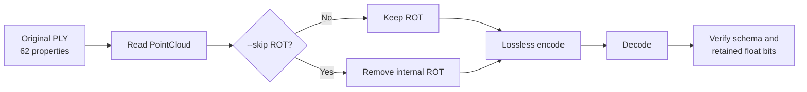

# Task 4 Report: Omit rotation from Draco-for-3DGS

Date: 2026-07-28
Result: **PASS**

## Objective

Feed the original 3DGS PLY to Draco, omit rotation before encoding, decode the
DRC, and confirm that the reconstructed PLY has no rotation properties while
all retained data remains exact.

## Implementation

Added an explicit command:

```bash
--skip ROT
```

The existing meanings remain unchanged:

```text
-qr 16       keep and quantize rotation
-qr 0        keep rotation without quantization
--skip ROT   omit rotation completely
```

Two helpers keep the implementation modular:

```cpp
DeleteNamedAttributes(...)
ApplyRotationSkip(...)
```

`DeleteNamedAttributes` is the reusable mechanism.
`ApplyRotationSkip` contains the Task 4 policy.

No original quantization branch was deleted. Rotation omission also does not
trigger point deduplication, protecting Gaussian count and ordering.

## Workflow



## Commands

Build:

```bash
cd $REPO
cmake -S . -B build-exp4
cmake --build build-exp4 --parallel
```

Baseline:

```bash
./build-exp4/draco_encoder-1.5.6 \
  -point_cloud \
  -i testdata/3DGS/3dgs.ply \
  -o experiment_results/7-28-26exp/exp4_skip_rotation/baseline_with_rotation.drc \
  -qp 0 -qn 0 \
  -qfd 0 -qfr1 0 -qfr2 0 -qfr3 0 \
  -qo 0 -qs 0 -qr 0 \
  -cl 7

./build-exp4/draco_decoder-1.5.6 \
  -point_cloud \
  -i experiment_results/7-28-26exp/exp4_skip_rotation/baseline_with_rotation.drc \
  -o experiment_results/7-28-26exp/exp4_skip_rotation/decoded_with_rotation.ply
```

Skip rotation:

```bash
./build-exp4/draco_encoder-1.5.6 \
  -point_cloud \
  --skip ROT \
  -i testdata/3DGS/3dgs.ply \
  -o experiment_results/7-28-26exp/exp4_skip_rotation/without_rotation.drc \
  -qp 0 -qn 0 \
  -qfd 0 -qfr1 0 -qfr2 0 -qfr3 0 \
  -qo 0 -qs 0 \
  -cl 7

./build-exp4/draco_decoder-1.5.6 \
  -point_cloud \
  -i experiment_results/7-28-26exp/exp4_skip_rotation/without_rotation.drc \
  -o experiment_results/7-28-26exp/exp4_skip_rotation/decoded_without_rotation.ply
```

## Verification

The independent verifier compares retained properties by name and original
row:

```bash
python3 experiment_results/7-28-26exp/exp4_skip_rotation/verify_exp4.py \
  --source testdata/3DGS/3dgs.ply \
  --decoded experiment_results/7-28-26exp/exp4_skip_rotation/decoded_without_rotation.ply \
  --expect-missing rot_0 \
  --expect-missing rot_1 \
  --expect-missing rot_2 \
  --expect-missing rot_3 \
  --output experiment_results/7-28-26exp/exp4_skip_rotation/skip_rotation_verification.json
```

## Comparison

| Check | Baseline | `--skip ROT` |
|---|---:|---:|
| Gaussian count | 136,641 | 136,641 |
| Property count | 62 | 58 |
| `rot_0..3` | Present | Absent |
| Unexpected missing properties | 0 | 0 |
| Unexpected extra properties | 0 | 0 |
| Retained changed rows | 0 | 0 |
| Retained changed float32 values | 0 | 0 |
| Retained property order | Preserved | Preserved |
| Baseline/source byte equality | Yes | Not applicable by design |

## Size comparison

| Artifact | Bytes |
|---|---:|
| Original PLY | 33,888,499 |
| Baseline DRC with rotation | 33,887,039 |
| Baseline decoded PLY | 33,888,499 |
| DRC without rotation | 31,700,777 |
| Decoded PLY without rotation | 31,702,159 |

Removing rotation saved:

```text
DRC: 2,186,262 bytes (6.451617%)
Decoded PLY: 2,186,340 bytes (6.451569%)
```

The four float32 rotation properties contain 2,186,256 raw bytes. The small
additional saving comes from removed attribute/header metadata.

## Checksums

```text
Original and baseline decoded PLY:
be1e690a9e9a2543a39f7181fec0062f088221b968acd617940ff96679661a4c

Baseline DRC:
d45f68080edc1f13ebdef136a01ac9fef076b00347fc3f01b6e5a2f884f94b11

DRC without rotation:
90c2600219db1dbd6899941ab8ca364056bfbbe689af85a2d9e6aa0e18140b84

Decoded PLY without rotation:
98da1085b1da2701f5eceea33fcc49e19a309f556aab3e2d4bf2d97a18b7524e
```

## Conclusion

The new modular option successfully removes rotation from the encoded
representation. After decoding, `rot_0..3` are absent and every retained value
is bit-exact at the same Gaussian row. Gaussian count and order are preserved,
and existing lossless behavior remains unchanged when `--skip ROT` is not
used.

The decoded no-rotation PLY is ready for a SuperSplat compatibility test.
SuperSplat may reject it or may synthesize a default rotation; that behavior
must be recorded separately.

## Focused position and color check

| Group | Float32 values compared | Changed | Exact |
|---|---:|---:|:---:|
| Position: `x`, `y`, `z` | 409,923 | 0 | Yes |
| Base color: `f_dc_0..2` | 409,923 | 0 | Yes |
| Higher SH/color: `f_rest_0..44` | 6,148,845 | 0 | Yes |

Every position and color coefficient remains bit-for-bit identical at the
same Gaussian row after rotation is removed, encoded, and decoded.
