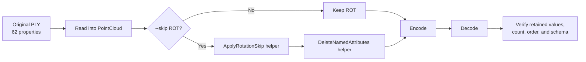

# Task 4 Log: Skip rotation during Draco encoding

Date: 2026-07-28
Status: **RUNNING**

## Objective

Add a modular `--skip ROT` encoder option. It must remove only the in-memory
`GeometryAttribute::ROT` after reading the original PLY and before encoding.
The source PLY and existing quantization behavior must remain intact.

## Planned flow



## Execution record

### Record the untouched source state

Terminal:

```bash
cd $REPO

git status --short src/draco/tools/draco_encoder.cc
sha256sum \
  src/draco/tools/draco_encoder.cc \
  testdata/3DGS/3dgs.ply
```

Why:

Record the starting encoder source and input identities before implementation.
The original PLY must never be overwritten.

Observed:

```text
draco_encoder.cc status: clean
draco_encoder.cc SHA-256:
fe0ac60e2869d2ca60ee61c789aa96c77c2d59ff81ab7fb1b8030826b1201c7b
Input PLY SHA-256:
be1e690a9e9a2543a39f7181fec0062f088221b968acd617940ff96679661a4c
```

### Inspect the existing rotation path

Why:

Confirm where rotation is read, quantized, and written before choosing the
extension point.

Findings:

- `ply_decoder.cc` converts `rot_0..3` into one internal `ROT` attribute.
- `draco_encoder.cc` quantizes `ROT` when `-qr` is greater than zero.
- Existing `--skip` supports `NORMAL`, `TEX_COORD`, and `GENERIC`, but not
  `ROT`.
- A negative `-qr` currently prevents quantization but does not delete `ROT`.
- `ply_encoder.cc` writes `rot_0..3` only when an internal `ROT` attribute is
  present.

### Implement modular rotation skipping

Changed file:

```text
src/draco/tools/draco_encoder.cc
```

Added:

```cpp
bool DeleteNamedAttributes(
    draco::PointCloud *point_cloud,
    draco::GeometryAttribute::Type attribute_type);

void ApplyRotationSkip(
    draco::PointCloud *point_cloud,
    Options *options);
```

Also added:

- `Options::skip_rotation`, which records the command-line request;
- `Options::rotation_deleted`, which records whether `ROT` existed and was
  removed;
- `--skip ROT` parsing;
- `Rotation: Skipped` terminal reporting;
- `ROT` in the help text.

Why:

Keep the generic deletion mechanism separate from the Task 4 rotation policy.
No existing quantization branch was removed or redefined. The helper is called
after input loading and before quantization/encoding.

Ordering decision:

`rotation_deleted` was deliberately not added to the existing point-ID
deduplication condition. Task 4 should omit four properties without merging,
removing, or reordering Gaussian rows.

### Configure a separate build

Terminal:

```bash
cd $REPO
cmake -S . -B build-exp4
```

Why:

Keep the known `build-local` programs intact and make the experimental binary
easy to distinguish.

Observed:

```text
Configuration and generation completed.
Build files written to build-exp4.
```

Note:

`git diff --check` also reported pre-existing trailing whitespace in the
user-modified `README.md`. Task 4 did not modify or clean that unrelated file.

### Build and check the experimental CLI

Terminal:

```bash
cmake --build build-exp4 --parallel
./build-exp4/draco_encoder-1.5.6 -h
```

Why:

Compile the additive change and confirm that the public CLI advertises the new
option.

Observed:

```text
draco_encoder and draco_decoder built successfully.
Help includes:
--skip ATTRIBUTE_NAME skip a given attribute
(NORMAL, TEX_COORD, GENERIC, ROT)
```

Result: **PASS**

### Create the independent verifier

File:

```text
experiment_results/exp4_skip_rotation/verify_exp4.py
```

Why:

Whole-file `cmp` is invalid for the skip variant because four properties are
intentionally absent. This standard-library verifier compares common
properties by name and row, validates the precise missing-property list,
checks count and retained order, and counts changed float32 values.

### Run the lossless baseline with rotation

Terminal:

```bash
./build-exp4/draco_encoder-1.5.6 \
  -point_cloud \
  -i testdata/3DGS/3dgs.ply \
  -o experiment_results/exp4_skip_rotation/baseline_with_rotation.drc \
  -qp 0 -qn 0 \
  -qfd 0 -qfr1 0 -qfr2 0 -qfr3 0 \
  -qo 0 -qs 0 -qr 0 \
  -cl 7

./build-exp4/draco_decoder-1.5.6 \
  -point_cloud \
  -i experiment_results/exp4_skip_rotation/baseline_with_rotation.drc \
  -o experiment_results/exp4_skip_rotation/decoded_with_rotation.ply

python3 experiment_results/exp4_skip_rotation/verify_exp4.py \
  --source testdata/3DGS/3dgs.ply \
  --decoded experiment_results/exp4_skip_rotation/decoded_with_rotation.ply \
  --output experiment_results/exp4_skip_rotation/baseline_verification.json
```

Why:

Prove that the experimental build retains the existing behavior when the new
option is not requested.

Observed:

```text
Rotation: No quantization
Gaussians: 136,641 -> 136,641
Properties: 62 -> 62
Missing properties: none
Changed retained values: 0
Source and decoded PLY cmp exit status: 0
Baseline DRC size: 33,887,039 bytes
```

Result: **PASS — existing lossless behavior preserved**

### Run Task 4 with rotation skipped

Terminal:

```bash
./build-exp4/draco_encoder-1.5.6 \
  -point_cloud \
  --skip ROT \
  -i testdata/3DGS/3dgs.ply \
  -o experiment_results/exp4_skip_rotation/without_rotation.drc \
  -qp 0 -qn 0 \
  -qfd 0 -qfr1 0 -qfr2 0 -qfr3 0 \
  -qo 0 -qs 0 \
  -cl 7

./build-exp4/draco_decoder-1.5.6 \
  -point_cloud \
  -i experiment_results/exp4_skip_rotation/without_rotation.drc \
  -o experiment_results/exp4_skip_rotation/decoded_without_rotation.ply

python3 experiment_results/exp4_skip_rotation/verify_exp4.py \
  --source testdata/3DGS/3dgs.ply \
  --decoded experiment_results/exp4_skip_rotation/decoded_without_rotation.ply \
  --expect-missing rot_0 \
  --expect-missing rot_1 \
  --expect-missing rot_2 \
  --expect-missing rot_3 \
  --output experiment_results/exp4_skip_rotation/skip_rotation_verification.json
```

Why:

Exercise the new modular helper and prove that rotation—not its precision—is
removed from the encoded representation.

Observed:

```text
Encoder: Rotation: Skipped
Gaussians: 136,641 -> 136,641
Properties: 62 -> 58
Missing: rot_0, rot_1, rot_2, rot_3
Unexpected missing/extra properties: none
Retained property order preserved: yes
Changed retained rows: 0
Changed retained float32 values: 0
Skip DRC size: 31,700,777 bytes
Decoded PLY size: 31,702,159 bytes
```

Result: **PASS**

### Record sizes, checksums, and header

Terminal:

```bash
stat -c '%n %s bytes' \
  testdata/3DGS/3dgs.ply \
  experiment_results/exp4_skip_rotation/baseline_with_rotation.drc \
  experiment_results/exp4_skip_rotation/decoded_with_rotation.ply \
  experiment_results/exp4_skip_rotation/without_rotation.drc \
  experiment_results/exp4_skip_rotation/decoded_without_rotation.ply

sha256sum \
  testdata/3DGS/3dgs.ply \
  experiment_results/exp4_skip_rotation/baseline_with_rotation.drc \
  experiment_results/exp4_skip_rotation/decoded_with_rotation.ply \
  experiment_results/exp4_skip_rotation/without_rotation.drc \
  experiment_results/exp4_skip_rotation/decoded_without_rotation.ply

sed -n '1,/end_header/p' \
  experiment_results/exp4_skip_rotation/decoded_without_rotation.ply
```

Why:

Capture reproducible artifact identities and directly confirm the decoded
header ends after `scale_2`, with no rotation property declarations.

Measured reduction:

```text
DRC saving versus baseline: 2,186,262 bytes (6.451617%)
Decoded PLY saving versus original: 2,186,340 bytes (6.451569%)
```

The raw rotation payload is 136,641 × 4 × 4 = 2,186,256 bytes. The additional
6 DRC bytes and 84 PLY bytes come from removing rotation-related format/header
overhead.

### Final build and CLI error-path check

Terminal:

```bash
cmake --build build-exp4 --parallel
./build-exp4/draco_encoder-1.5.6 -h
./build-exp4/draco_encoder-1.5.6 \
  --skip BAD \
  -i testdata/3DGS/3dgs.ply \
  -o /tmp/exp4_invalid.drc
```

Why:

Rebuild after clarifying the help text and confirm unsupported skip names fail
instead of being silently ignored.

Observed:

```text
Help: Use --skip ROT to omit rotation from the encoded point cloud
Invalid option message: Error: Invalid attribute name after --skip
Invalid option exit status: 255 (nonzero)
```

Result: **PASS**

## Final status

Task 4: **PASS**

- Original source code branches were retained.
- The new behavior is explicit, additive, and modular.
- Baseline lossless behavior remains byte-for-byte identical.
- The skip variant omits exactly four rotation properties.
- Gaussian count and retained row order remain unchanged.
- Every retained float32 value is bit-exact.
- The input PLY checksum remains unchanged.

Status: **COMPLETE**

## Focused XYZ and color verification

The verifier was extended to report position and color groups explicitly, then
rerun against `decoded_without_rotation.ply`.

Terminal:

```bash
python3 experiment_results/exp4_skip_rotation/verify_exp4.py \
  --source testdata/3DGS/3dgs.ply \
  --decoded experiment_results/exp4_skip_rotation/decoded_without_rotation.ply \
  --expect-missing rot_0 \
  --expect-missing rot_1 \
  --expect-missing rot_2 \
  --expect-missing rot_3 \
  --output experiment_results/exp4_skip_rotation/skip_rotation_verification.json
```

Why:

Make the position and SH/color evidence visible separately instead of relying
only on the aggregate “all retained values exact” result.

Observed:

| Group | Values compared | Changed values | Result |
|---|---:|---:|---|
| Position `x`, `y`, `z` | 409,923 | 0 | Bit-exact |
| Base color `f_dc_0..2` | 409,923 | 0 | Bit-exact |
| Higher SH/color `f_rest_0..44` | 6,148,845 | 0 | Bit-exact |

Every individual `x`, `y`, `z`, `f_dc_*`, and `f_rest_*` property reported
zero changed values.

Result: **PASS**
