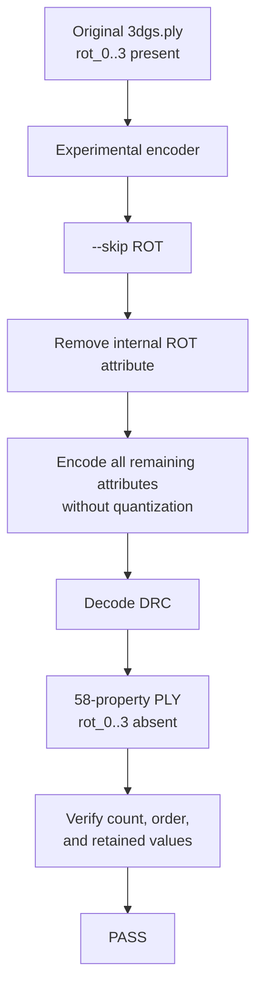

# Task 4 Simplified Log and Conclusion

## Experiment flow



## Step-by-step terminal log

### 1. Configure and build separately

```bash
cd $REPO
cmake -S . -B build-exp4
cmake --build build-exp4 --parallel
```

Why: preserve the existing `build-local` binaries and clearly identify the
experimental build.

### 2. Check the new option

```bash
./build-exp4/draco_encoder-1.5.6 -h
```

Why: confirm the public CLI lists `ROT` as a skippable attribute.

### 3. Run the unchanged baseline

```bash
./build-exp4/draco_encoder-1.5.6 \
  -point_cloud \
  -i testdata/3DGS/3dgs.ply \
  -o experiment_results/exp4_skip_rotation/baseline_with_rotation.drc \
  -qp 0 -qn 0 -qfd 0 \
  -qfr1 0 -qfr2 0 -qfr3 0 \
  -qo 0 -qs 0 -qr 0 -cl 7

./build-exp4/draco_decoder-1.5.6 \
  -point_cloud \
  -i experiment_results/exp4_skip_rotation/baseline_with_rotation.drc \
  -o experiment_results/exp4_skip_rotation/decoded_with_rotation.ply
```

Why: prove the added feature does not change normal lossless behavior.

Result: the decoded PLY is byte-for-byte identical to the original.

### 4. Encode without rotation

```bash
./build-exp4/draco_encoder-1.5.6 \
  -point_cloud \
  --skip ROT \
  -i testdata/3DGS/3dgs.ply \
  -o experiment_results/exp4_skip_rotation/without_rotation.drc \
  -qp 0 -qn 0 -qfd 0 \
  -qfr1 0 -qfr2 0 -qfr3 0 \
  -qo 0 -qs 0 -cl 7
```

Why: remove the `ROT` attribute itself instead of merely changing rotation
precision.

Observed:

```text
Rotation: Skipped
Encoded size: 31,700,777 bytes
```

### 5. Decode

```bash
./build-exp4/draco_decoder-1.5.6 \
  -point_cloud \
  -i experiment_results/exp4_skip_rotation/without_rotation.drc \
  -o experiment_results/exp4_skip_rotation/decoded_without_rotation.ply
```

Why: create the PLY that should contain no rotation properties.

### 6. Verify by property and row

```bash
python3 experiment_results/exp4_skip_rotation/verify_exp4.py \
  --source testdata/3DGS/3dgs.ply \
  --decoded experiment_results/exp4_skip_rotation/decoded_without_rotation.ply \
  --expect-missing rot_0 \
  --expect-missing rot_1 \
  --expect-missing rot_2 \
  --expect-missing rot_3 \
  --output experiment_results/exp4_skip_rotation/skip_rotation_verification.json
```

Why: whole-file comparison cannot pass after intentionally removing four
properties. The verifier checks all 58 retained properties at their original
Gaussian rows.

## Final comparison chart

| Measurement | With rotation | Without rotation |
|---|---:|---:|
| Gaussians | 136,641 | 136,641 |
| PLY properties | 62 | 58 |
| Rotation properties | 4 | 0 |
| Retained changed values | 0 | 0 |
| Retained changed rows | 0 | 0 |
| DRC size | 33,887,039 bytes | 31,700,777 bytes |
| Decoded PLY size | 33,888,499 bytes | 31,702,159 bytes |
| Gaussian ordering | Preserved | Preserved |

## Conclusion

Task 4 passed. The encoder now has an explicit, modular `--skip ROT` feature.
The decoded PLY contains no rotation, while every retained value, Gaussian
row, and property order remains exact. Omitting rotation reduced the DRC by
2,186,262 bytes, or 6.451617%.

Focused verification also confirmed:

| Data | Compared values | Changed values |
|---|---:|---:|
| `x`, `y`, `z` | 409,923 | 0 |
| `f_dc_0..2` | 409,923 | 0 |
| `f_rest_0..44` | 6,148,845 | 0 |
