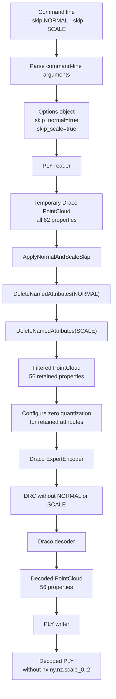
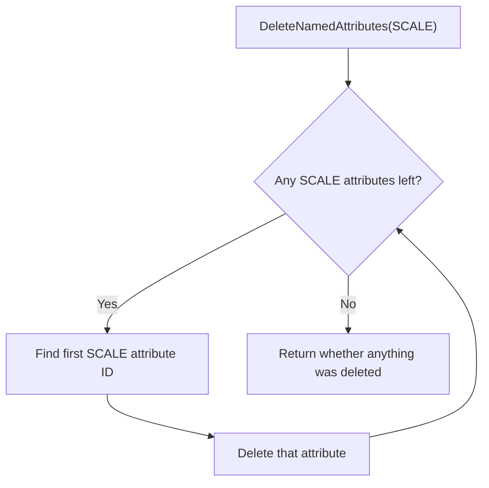
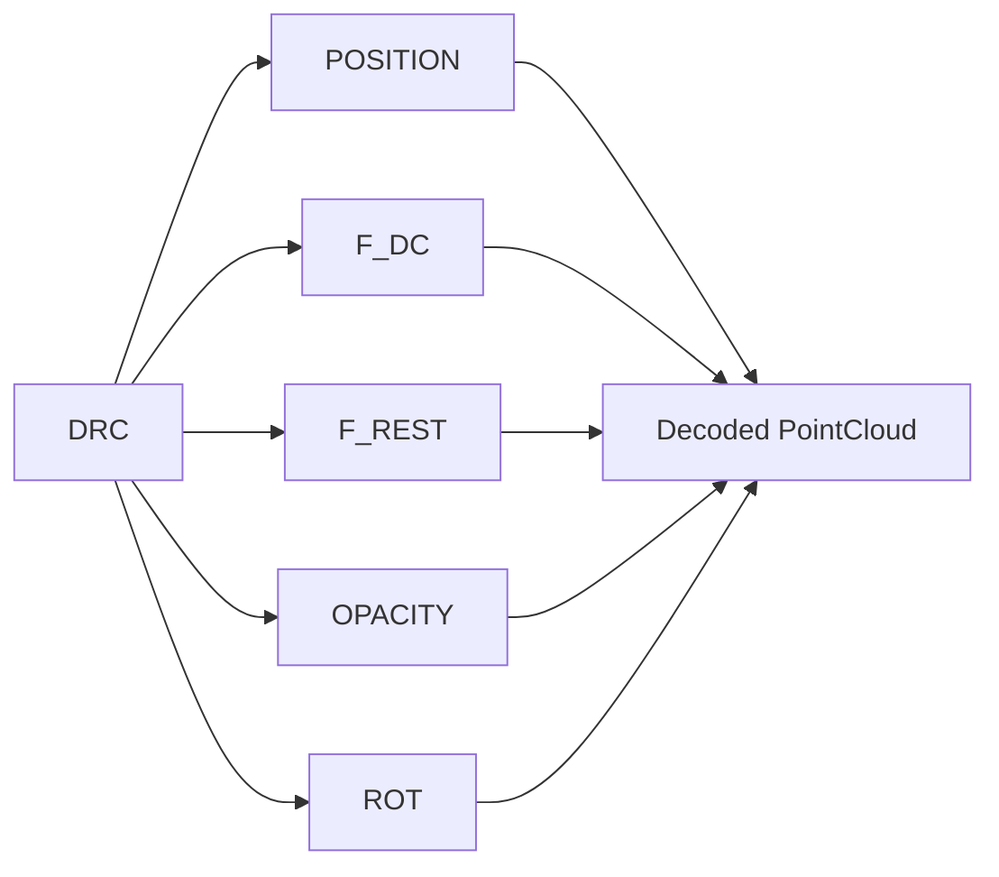
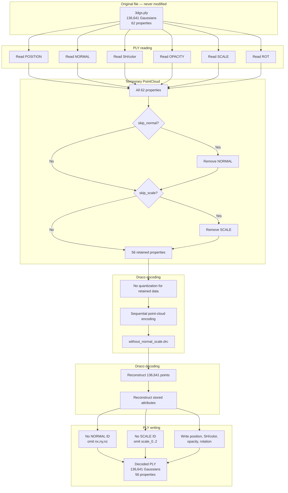

# How attribute skipping works in Draco-for-3DGS

## The simple idea

Think of every Gaussian as carrying a backpack:

```text
Gaussian backpack
├── Position: x, y, z
├── Normal: nx, ny, nz
├── Base color: f_dc_0..2
├── Extra color: f_rest_0..44
├── Opacity
├── Scale: scale_0..2
└── Rotation: rot_0..3
```

Normally, Draco puts the entire backpack into the compressed DRC file.

The `--skip` command says:

> Before encoding, take one selected item out of the temporary backpack.

For example:

```bash
--skip NORMAL --skip SCALE
```

means:

> Read the original PLY normally, but do not include NORMAL or SCALE in the
> encoded DRC.

The original PLY is never edited.

## Why `--skip` is different from quantization

Quantization controls how accurately an attribute is represented. It does not
normally mean that the attribute is absent.

For NORMAL:

| Command | Included in DRC? | Quantized? |
|---|:---:|:---:|
| `-qn 16` | Yes | Yes |
| `-qn 0` | Yes | No |
| `--skip NORMAL` | No | Not applicable |

For SCALE:

| Command | Included in DRC? | Quantized? |
|---|:---:|:---:|
| `-qs 16` | Yes | Yes |
| `-qs 0` | Yes | No |
| `--skip SCALE` | No | Not applicable |

This gives the user two independent decisions:

1. Should this attribute exist in the encoded data?
2. If it exists, should it be quantized?

## Complete architecture



The required order is:

```text
Read → Skip → Configure encoding → Encode
```

The attributes must be removed before the ExpertEncoder receives the point
cloud.

## Step 1: Parse the command

The user runs:

```bash
./draco_encoder \
  -point_cloud \
  --skip NORMAL \
  --skip SCALE \
  -i 3dgs.ply \
  -o without_normal_scale.drc
```

The parser recognizes each `--skip` occurrence:

```cpp
if (!strcmp("NORMAL", argv[i + 1])) {
  options.skip_normal = true;
} else if (!strcmp("SCALE", argv[i + 1])) {
  options.skip_scale = true;
} else if (!strcmp("ROT", argv[i + 1])) {
  options.skip_rotation = true;
}
```

At this stage, no attribute has been removed. The parser only records the
request:

```text
skip_normal = true
skip_scale  = true
```

Because the parser accepts repeated `--skip` options, NORMAL and SCALE can be
requested together or independently.

An unknown name is rejected:

```bash
--skip BAD
```

produces:

```text
Error: Invalid attribute name after --skip
```

## Step 2: Store intent and outcome separately

The encoder's `Options` structure contains:

```cpp
bool skip_normal;
bool skip_scale;
bool scale_deleted;
bool skip_rotation;
bool rotation_deleted;
```

There are two kinds of state:

| State | Meaning |
|---|---|
| `skip_normal` | The user requested that NORMAL be skipped |
| `skip_scale` | The user requested that SCALE be skipped |
| `normals_deleted` | A NORMAL attribute was found and removed |
| `scale_deleted` | A SCALE attribute was found and removed |

This difference matters when the user requests an attribute that is not
present in an input file. The request can be true even if nothing needs to be
removed.

The default skip values are false, so encoding is unchanged when no explicit
skip option is supplied.

## Step 3: Read the original PLY normally

The PLY reader loads the source into a temporary `draco::PointCloud`.

The three normal properties become one internal Draco attribute:

```text
nx ─┐
ny ─┼──> GeometryAttribute::NORMAL
nz ─┘
```

The three scale properties are also grouped:

```text
scale_0 ─┐
scale_1 ─┼──> GeometryAttribute::SCALE
scale_2 ─┘
```

The complete temporary point cloud initially contains:

```text
POSITION
NORMAL
F_DC
F_REST_1
F_REST_2
F_REST_3
OPACITY
SCALE
ROT
```

This is why the implementation removes two Draco attributes rather than
manually deleting six PLY properties.

Removing one grouped attribute also prevents invalid partial states, such as
retaining `scale_0` while losing `scale_1`.

## Step 4: Reusable deletion mechanism

The generic helper is:

```cpp
bool DeleteNamedAttributes(
    draco::PointCloud *point_cloud,
    const draco::GeometryAttribute::Type attribute_type) {
  bool deleted = false;

  while (point_cloud->NumNamedAttributes(attribute_type) > 0) {
    point_cloud->DeleteAttribute(
        point_cloud->GetNamedAttributeId(attribute_type, 0));
    deleted = true;
  }

  return deleted;
}
```

Its job is purely mechanical:

1. Ask whether the PointCloud contains an attribute of the requested type.
2. Find its internal attribute ID.
3. Delete it from the temporary PointCloud.
4. Repeat in case more than one attribute of that type exists.
5. Return whether anything was removed.



## Step 5: Policy helper

The policy helper decides which deletion mechanism to call:

```cpp
void ApplyNormalAndScaleSkip(
    draco::PointCloud *point_cloud,
    Options *options) {
  if (options->skip_normal) {
    options->normals_deleted =
        DeleteNamedAttributes(
            point_cloud,
            draco::GeometryAttribute::NORMAL);
  }

  if (options->skip_scale) {
    options->scale_deleted =
        DeleteNamedAttributes(
            point_cloud,
            draco::GeometryAttribute::SCALE);
  }
}
```

This separates two responsibilities:

```text
DeleteNamedAttributes
    = mechanism: how to remove a named attribute

ApplyNormalAndScaleSkip
    = policy: which requested attributes to remove
```

Rotation follows the same architecture through:

```cpp
ApplyRotationSkip(...)
```

and:

```cpp
DeleteNamedAttributes(point_cloud, GeometryAttribute::ROT);
```

## Step 6: Apply the skip at the correct point

The skip helpers run:

```cpp
ApplyNormalAndScaleSkip(pc.get(), &options);
ApplyRotationSkip(pc.get(), &options);
```

They execute:

```text
after the PLY is loaded
before quantization options are applied
before the ExpertEncoder is created
before the DRC is written
```

This location keeps the architecture clean:

```text
PLY reader responsibility:
    Read the file correctly.

Encoder CLI responsibility:
    Decide which attributes should be encoded.
```

Changing the PLY reader to ignore NORMAL or SCALE would affect every caller
of that reader. The command-line filter is isolated and can be turned on or
off for each encoding operation.

## PointCloud before and after skipping

Before:

```text
PointCloud
├── POSITION        x, y, z
├── NORMAL          nx, ny, nz
├── F_DC            f_dc_0..2
├── F_REST_1        f_rest_0..8
├── F_REST_2        f_rest_9..23
├── F_REST_3        f_rest_24..44
├── OPACITY         opacity
├── SCALE           scale_0..2
└── ROT             rot_0..3
```

After `--skip NORMAL --skip SCALE`:

```text
PointCloud
├── POSITION        x, y, z
├── F_DC            f_dc_0..2
├── F_REST_1        f_rest_0..8
├── F_REST_2        f_rest_9..23
├── F_REST_3        f_rest_24..44
├── OPACITY         opacity
└── ROT             rot_0..3
```

Property count:

```text
62 original properties
− 3 normal properties
− 3 scale properties
= 56 retained properties
```

## Why explicit 3DGS skipping avoids point deduplication

Draco contains a point-ID deduplication path that may run after some
attributes are deleted.

Imagine two separate Gaussians:

```text
Gaussian A: same position and color, different normal
Gaussian B: same position and color, different normal
```

After NORMAL is removed, they might look identical according to their
remaining attributes. Deduplication might try to combine them.

That is unsafe for this experiment because each Gaussian must remain an
individual row, even if some retained values happen to be identical.

The explicit NORMAL skip is excluded from this deduplication condition:

```cpp
(options.normals_deleted && !options.skip_normal)
```

With explicit `--skip NORMAL`:

```text
normals_deleted = true
skip_normal     = true

true && !true
true && false
false
```

Therefore, this explicit skip does not activate that point-ID deduplication
branch. This protects Gaussian count, identity, and row ordering.

## Step 7: Configure retained attributes

After NORMAL and SCALE are absent, zero quantization is selected for the
retained data:

```bash
-qp 0
-qfd 0
-qfr1 0
-qfr2 0
-qfr3 0
-qo 0
-qr 0
```

The logical order is:

```text
First decide whether an attribute exists.
Then configure how retained attributes are encoded.
```

`-qn` and `-qs` are unnecessary in the combined skip command because NORMAL
and SCALE no longer exist in the PointCloud supplied to the encoder.

## Step 8: Encode only what remains

The `ExpertEncoder` is created from the filtered PointCloud.

At that moment, it can see:

```text
POSITION
F_DC
F_REST_1
F_REST_2
F_REST_3
OPACITY
ROT
```

It cannot encode NORMAL or SCALE because those attributes are no longer in
the temporary PointCloud.

The DRC does not contain empty placeholders for them. They are absent from
the encoded representation.

## Step 9: Decode

The Draco decoder reconstructs the attributes stored in the DRC:



The decoder does not invent default NORMAL or SCALE values.

## Step 10: Write the decoded PLY

The PLY writer asks the decoded PointCloud which attributes exist.

Conceptually:

```cpp
if (normal_att_id >= 0) {
  write nx;
  write ny;
  write nz;
}

if (scale_att_id >= 0) {
  write scale_0;
  write scale_1;
  write scale_2;
}
```

Because NORMAL and SCALE are absent, their IDs indicate “not found,” so those
header properties and their data are not written.

ROT still exists, so `rot_0..3` are written normally.

## Full end-to-end flow



## How the implementation was verified

The experiment did not rely only on the encoder's `Skipped` message.

### Schema verification

Expected and actual missing properties:

```text
nx
ny
nz
scale_0
scale_1
scale_2
```

No other properties were missing or added.

### Gaussian count

```text
Original: 136,641
Decoded:  136,641
```

### Ordering

Every retained decoded value was compared with the value at the same row in
the original PLY:

```text
Changed rows: 0
```

If Gaussian order had changed, same-row values would generally differ.

### Bit-exact retained values

| Group | Values checked | Changed |
|---|---:|---:|
| Position | 409,923 | 0 |
| `f_dc` | 409,923 | 0 |
| `f_rest` | 6,148,845 | 0 |
| Opacity | 136,641 | 0 |
| Rotation | 546,564 | 0 |

Every retained float32 bit pattern was preserved.

## Summary

The entire architecture can be remembered as:

```text
Read everything → remove selected temporary attributes → encode what remains
```

More precisely:

1. The CLI records the user's skip request.
2. The PLY reader loads the original data normally.
3. The policy helper selects NORMAL and SCALE.
4. The reusable helper deletes those internal named attributes.
5. Explicit 3DGS skipping avoids point-ID deduplication.
6. The ExpertEncoder receives only retained attributes.
7. The DRC contains no NORMAL or SCALE.
8. The decoder reconstructs only stored attributes.
9. The PLY writer naturally omits missing properties.
10. Verification confirms exact retained data, count, and order.

The original PLY remains unchanged throughout the process.
