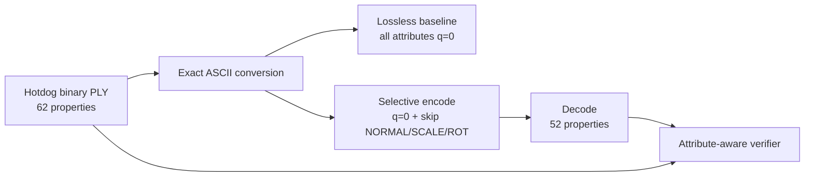

# Selective Lossless Hotdog Experiment

## Objective

Encode the Hotdog 3D Gaussian Splatting point cloud while retaining only
position, spherical-harmonic color, and opacity. Normal, scale, and rotation
must be absent after decoding, while every retained float32 value and Gaussian
row must remain exact.

In this report, **selective lossless** means that the chosen retained attributes
are bit-identical. It does not mean that the entire source is recoverable,
because 10 properties are intentionally deleted.

## Dataset and implementation

Input:

```text
testdata/3DGS/hotdog/checkpoint/point_cloud/iteration_30000/point_cloud.ply
```

Tested source revision:

```text
8e74e232005ebfd720dfc578e229a4faac36dd11
```

The encoder implementation recognizes repeated `--skip` arguments and deletes
the corresponding named attributes before encoding:

```bash
--skip NORMAL --skip SCALE --skip ROT
```

All retained quantizers are set to `0`, which disables quantization:

```bash
-qp 0 -qfd 0 -qfr1 0 -qfr2 0 -qfr3 0 -qo 0
```

## Attribute selection

| Group | Source properties | Result | Encoding |
|---|---:|---|---|
| Position | 3 | Kept | No quantization |
| Normal | 3 | Removed | `--skip NORMAL` |
| Base SH color (`f_dc`) | 3 | Kept | No quantization |
| Higher SH color (`f_rest`) | 45 | Kept | No quantization |
| Opacity | 1 | Kept | No quantization |
| Scale | 3 | Removed | `--skip SCALE` |
| Rotation | 4 | Removed | `--skip ROT` |
| **Total** | **62** | **52 kept, 10 removed** | |

Across 148,783 Gaussians, this removes 1,487,830 float32 values and retains
7,736,716 values.

## Method



The binary source was converted to ASCII because this fork's documented input
workflow uses ASCII PLY. A standard-library streaming converter formatted each
float with nine significant digits, sufficient for exact float32 round trips.
An independent verifier parsed the ASCII values back to float32 and confirmed
zero changed bits before encoding.

An all-attribute zero-quantization round trip established the baseline. The
decoded baseline was byte-for-byte identical to the original PLY. The selective
round trip then used the same retained-attribute precision while deleting
normal, scale, and rotation.

## Verification results

| Check | Result |
|---|---|
| ASCII conversion exact | Pass |
| Baseline byte equality | Pass |
| Source Gaussian count | 148,783 |
| Selective decoded Gaussian count | 148,783 |
| Gaussian count preserved | Pass |
| Source property count | 62 |
| Selective property count | 52 |
| Missing properties exactly match expectation | Pass |
| Unexpected properties | None |
| Retained property order preserved | Pass |
| Rows with changed retained values | 0 |
| Rows with changed positions | 0 |
| Non-finite retained values | 0 |
| All retained float32 values bit-exact | Pass |

Exact missing properties:

```text
nx ny nz
scale_0 scale_1 scale_2
rot_0 rot_1 rot_2 rot_3
```

Exact retained groups:

| Group | Values compared | Changed | Result |
|---|---:|---:|---|
| Position | 446,349 | 0 | Bit-exact |
| Base SH color | 446,349 | 0 | Bit-exact |
| Higher SH color | 6,695,235 | 0 | Bit-exact |
| Opacity | 148,783 | 0 | Bit-exact |
| **Total** | **7,736,716** | **0** | **Bit-exact** |

Detailed machine-readable evidence is stored in:

- `ascii_verification.json`
- `baseline_verification.json`
- `selective_verification.json`

## File sizes

| Artifact | Size |
|---|---:|
| Source binary PLY | 36,899,715 bytes |
| Temporary ASCII PLY | 115,157,382 bytes |
| Full lossless baseline `.drc` | 36,898,255 bytes |
| Baseline decoded PLY | 36,899,715 bytes |
| Selective `.drc` | 30,946,917 bytes |
| Selective decoded PLY | 30,948,188 bytes |

Compared with the full lossless baseline, the selective bitstream saved
5,951,338 bytes, or **16.129050%**. Compared with the original binary PLY, it
was 16.132369% smaller.

The reduction comes almost entirely from deleting attributes. As shown by the
baseline, zero-quantization Draco otherwise produces essentially no compression
for this dataset.

## Timings

| Stage | Wall time | Peak RSS |
|---|---:|---:|
| Configure | 0.45 s | 28,484 KiB |
| Clean build | 54.15 s | 312,048 KiB |
| Binary-to-ASCII conversion | 2.07 s | 16,024 KiB |
| ASCII exactness verification | 2.22 s | 15,948 KiB |
| Baseline encode | 0.79 s | 188,876 KiB |
| Baseline decode | 0.12 s | 125,424 KiB |
| Baseline verification | 4.61 s | 22,656 KiB |
| Selective encode | 0.76 s | 188,808 KiB |
| Selective decode | 0.09 s | 106,196 KiB |
| Selective verification | 4.35 s | 23,068 KiB |

The selective encode/decode commands took 0.85 seconds end to end. Draco's
internal timers measured 35 ms for encoding and 20 ms for decoding; the
end-to-end measurements also include input parsing and output writing.

## Reproduction

Run the self-contained workflow from the repository root:

```bash
bash experiment_results/8-18-26/hotdog_position_color_opacity/run_experiment.sh
```

See `README.md` in this directory for prerequisites, outputs, manual commands,
and result interpretation. See `log.md` for the complete command history.

## Limitation

The selective decoded file is intentionally incomplete as a conventional 3DGS
rendering asset. Scale and rotation normally define each Gaussian's covariance
and screen-space footprint. A renderer must supply replacement defaults or
another reconstruction method before it can render this file normally.

Therefore, this experiment proves exact retention and measurable storage
reduction; it does not prove equal rendered quality after deleting scale and
rotation.

## Conclusion

The experiment passed. Draco-for-3DGS can omit normal, scale, and rotation while
preserving Hotdog's position, all spherical-harmonic color coefficients,
opacity, Gaussian count, and row order exactly. The selective bitstream is
16.129050% smaller than the all-attribute lossless baseline.
