# Repository Learning Log

Repository: `Draco-for-3DGS`  
Workspace: `/home/nahathai/summer/Draco-for-3DGS`

This log records repository exploration and learning. It must not contain
secrets, credentials, model weights, large datasets, build outputs, or private
environment data.

## 2026-07-17 04:37:31 CST (+0800) — Repository orientation

### Goal

Understand the repository structure, technologies, external dependencies, main
entry points, and end-to-end execution flow before installing dependencies or
building the project.

### Git and workspace state

- Repository path: `/home/nahathai/summer/Draco-for-3DGS`
- Current branch: `main`
- Working tree at the start of orientation: clean
- Tracking branch: `origin/main`
- `origin`: `git@github.com:nahathaiw/Draco-for-3DGS.git`
- `upstream`: `git@github.com:SYJINTW/Draco-for-3DGS.git`
- The URL originally supplied (`git@github.com:nahathaiw/`) was incomplete;
  the configured remote identified the intended repository.
- No repository-level `AGENTS.md` was found.
- `submodules/3DGS-Interface` is registered but not initialized.

### Commands run

All commands in this orientation were read-only.

```bash
pwd
rg --files -g 'AGENTS.md' -g '!build' -g '!dist' -g '!outputs'

git branch --show-current
git status --short --branch
git remote -v
find . -mindepth 1 -maxdepth 2 -not -path './.git' -not -path './.git/*' -print | sort

rg --files
# File paths were filtered and counted with awk, sort, rg, and sed to identify
# extensions, documentation, manifests, scripts, configuration, and tests.

sed -n '1,240p' README.md
sed -n '1,240p' README_original.md
sed -n '1,240p' BUILDING.md
sed -n '1,240p' CMAKE.md
sed -n '1,240p' CONTRIBUTING.md
sed -n '1,240p' unity/README.md
sed -n '1,240p' unity/BUILDING.md
sed -n '1,240p' javascript/example/README.md
sed -n '1,240p' javascript/npm/draco3d/package.json
sed -n '1,240p' javascript/npm/draco3dgltf/package.json
sed -n '1,240p' docs/Gemfile
sed -n '1,240p' .gitmodules

rg -n 'int main\s*\(' --glob '*.{cc,cpp,c}' .
rg -n '__main__|def main\s*\(' --glob '*.py' .
rg -n '^(import|from) |subprocess|os\.system|Popen|ArgumentParser|add_argument|json\.|torch|cuda|render|encode|decode' myScript mytool --glob '*.py'

sed -n '1,280p' myScript/my_encoder.py
sed -n '1,280p' myScript/my_decoder.py
sed -n '1,280p' myScript/main.py
sed -n '1,280p' myScript/traditional_compression.py
sed -n '1,280p' mytool/3DGS_pcd_to_draco_pcd.py
sed -n '1,280p' myJson/template.json
sed -n '1,280p' myJson/template_sh0.json

git submodule status
rg -n '\[YC\]|f_dc_|f_rest_|opacity|scale_|rot_|qfd|qfr|qo|qs|qr' src CMakeLists.txt --glob '*.{cc,h,cmake,txt}'
sed -n '1,430p' src/draco/tools/draco_encoder.cc
sed -n '1,260p' src/draco/tools/draco_decoder.cc
sed -n '1,280p' cmake/draco_options.cmake
git log --oneline --decorate -12

git --version
cmake --version
c++ --version
python3 --version
node --version
npm --version
java -version
du -sh -- * .github .agents .codex
rg --files src | rg '(_test\.(cc|h)$|/test/|/tests/)'
find src/draco -mindepth 1 -maxdepth 1 -type d -printf '%f\n' | sort
```

### What the repository does

This project is a fork of Google Draco 1.5.6 adapted to compress 3D Gaussian
Splatting (3DGS) point clouds. Standard Draco handles geometry attributes such
as position, normals, colors, and texture coordinates. This fork explicitly
adds the 3DGS attributes:

- `f_dc_*`: base spherical-harmonic color coefficients
- `f_rest_*`: higher-order spherical-harmonic coefficients
- `opacity`: visibility/density of each Gaussian
- `scale_*`: dimensions of each Gaussian ellipsoid
- `rot_*`: orientation quaternion of each Gaussian

These groups have different numerical ranges and visual importance. The fork
therefore gives them separate quantization settings rather than forcing one
precision on every value.

### Languages, frameworks, package managers, and build tools

| Area | Technology | Role |
| --- | --- | --- |
| Core codec | C++ | Draco encoder, decoder, compression algorithms, PLY I/O |
| Build | CMake | Native builds, tests, WebAssembly, Unity, installation |
| Automation | Python | PLY conversion, experiment sweeps, logs, CSV aggregation |
| Browser | JavaScript and WebAssembly | Browser-side decoding and examples |
| Unity | C# and native plugins | Decode Draco assets inside Unity |
| Documentation | Markdown and Jekyll/Ruby | Project and bitstream documentation |
| Tests | C++ and GoogleTest | Unit tests for upstream codec components |

Dependency mechanisms include CMake, Git submodules, npm package manifests,
and a Ruby Gemfile. No Python dependency manifest, Dockerfile, Compose file, or
environment example was found.

### Major top-level components

- `src/`: C++ implementation and CLI tools; the core of the project.
- `cmake/`: build options, dependency handling, targets, tests, installation,
  CPU detection, Emscripten support, and cross-compilation toolchains.
- `mytool/`: ad hoc PLY conversion and inspection utilities.
- `myScript/`: experiment automation, encode/decode parameter sweeps, timing,
  CSV generation, and preparation of rendering directories.
- `myJson/`: experiment configuration templates. They currently contain
  author-specific absolute paths and must be adapted before use.
- `javascript/`: generated JavaScript/WASM codec artifacts, examples, and npm
  packages.
- `testdata/`: sample meshes, point clouds, glTF assets, and 3DGS test data.
- `docs/`: Jekyll site and detailed Draco bitstream specification.
- `unity/`: C# wrappers and prebuilt native Unity plugins.
- `maya/`: prebuilt Maya wrapper archives.
- `additional/`: bundled Closure Compiler JAR.
- `submodules/`: location intended for the external `3DGS-Interface` project.
- `.github/workflows/`: upstream-style build and test CI.
- `.vscode/`: local editor settings.

### Important files inspected

- `README.md`: fork-specific native/WASM build and 3DGS usage overview.
- `README_original.md`: retained upstream Draco 1.5.6 documentation.
- `BUILDING.md`: detailed CMake, testing, WebAssembly, Android, and platform
  instructions.
- `CMAKE.md`: explanation of the CMake implementation.
- `CMakeLists.txt`: root build definition and source/target lists.
- `cmake/draco_options.cmake`: optional features and their defaults.
- `.gitmodules`: external repository declarations.
- `mytool/3DGS_pcd_to_draco_pcd.py`: PLY format conversion using Apple MPS.
- `myScript/my_3DGS_pcd_to_draco_pcd.py`: similar conversion using CUDA.
- `myScript/my_encoder.py`: converts JSON settings into an encoder command.
- `myScript/my_decoder.py`: converts JSON settings into a decoder command.
- `myScript/main.py`: batch parameter sweeps, timing, CSV output, and render
  directory preparation.
- `myScript/traditional_compression.py`: gzip/bzip2 comparison experiments.
- `myJson/template.json` and `template_sh0.json`: example codec parameters.
- `src/draco/tools/draco_encoder.cc`: encoder CLI entry point and custom
  quantization flags.
- `src/draco/tools/draco_decoder.cc`: decoder CLI entry point.
- `src/draco/io/ply_decoder.cc`: maps 3DGS PLY properties into Draco
  attributes.
- `src/draco/io/ply_encoder.cc`: reconstructs 3DGS PLY property names.
- `javascript/example/README.md`: browser decoder example.
- `unity/README.md` and `unity/BUILDING.md`: Unity use and native plugin builds.
- `docs/spec/`: detailed Draco bitstream specification.

### Program execution flow

#### 1. Prepare the input

The intended input is a PLY point cloud produced by the original 3D Gaussian
Splatting project. The project README says it must be converted to ASCII PLY
before encoding.

The Python converter reads position, spherical harmonics, opacity, scale, and
rotation with `plyfile`; assembles the properties in the expected order; and
writes an ASCII PLY.

#### 2. Encode

Execution starts at `src/draco/tools/draco_encoder.cc`.

1. Parse input/output paths, `-point_cloud`, compression level, and
   quantization flags.
2. Load the PLY through `src/draco/io/ply_decoder.cc`.
3. Map PLY properties into named Draco point-cloud attributes.
4. Assign independent quantization precision:
   - `-qp`: position
   - `-qfd`: DC spherical harmonics
   - `-qfr1`, `-qfr2`, `-qfr3`: higher SH bands
   - `-qo`: opacity
   - `-qs`: scale
   - `-qr`: rotation
   - `-cl`: overall compression level
5. Run Draco point-cloud compression.
6. Write a binary `.drc` file.
7. Print timing and encoded size for the experiment scripts.

#### 3. Decode

Execution starts at `src/draco/tools/draco_decoder.cc`.

1. Read the `.drc` file into a byte buffer.
2. Detect whether it contains a mesh or point cloud.
3. Decode the point cloud and reconstruct its named attributes.
4. Use the custom PLY encoder to restore `f_dc_*`, `f_rest_*`, `opacity`,
   `scale_*`, and `rot_*` properties.
5. Write the decoded/distorted PLY and print decode timing.

#### 4. Run experiments and render

The Python experiment scripts execute the encoder/decoder repeatedly for
different quantization settings, parse timing/size logs, and write CSV results.
They can copy decoded point clouds and trained-model metadata into directories
expected by a Gaussian Splatting renderer or `3DGS-Interface`. The eventual
outputs are compressed files, reconstructed PLY files, timing/size CSV data,
and rendered images or quality measurements.

### Architecture

```mermaid
flowchart LR
    A[3DGS training output<br/>binary PLY] --> B[Python PLY converter]
    B --> C[ASCII 3DGS PLY]

    C --> D[draco_encoder CLI]
    D --> E[Custom PLY decoder]
    E --> F[Draco PointCloud<br/>with 3DGS attributes]
    F --> G[Per-attribute quantization]
    G --> H[Draco point-cloud compression]
    H --> I[Compressed .drc]

    I --> J[draco_decoder CLI]
    J --> K[Draco point-cloud decoder]
    K --> L[Reconstructed attributes]
    L --> M[Custom PLY encoder]
    M --> N[Decoded/distorted PLY]

    O[JSON experiment settings] --> P[Python experiment scripts]
    P --> D
    P --> J
    P --> Q[Timing and size logs]
    Q --> R[CSV summaries]

    N --> S[3DGS-Interface or<br/>Gaussian Splatting renderer]
    S --> T[Rendered images and<br/>quality evaluation]
```



### External dependencies

Native/core:

- C++ compiler
- CMake 3.12 or newer
- Make, Ninja, or another CMake generator/build tool

Optional/upstream features:

- GoogleTest for tests
- Eigen for mathematics
- TinyGLTF for glTF I/O
- `gulrak/filesystem` for filesystem compatibility
- Emscripten for WebAssembly
- Java and Closure Compiler for minifying generated JavaScript
- Android NDK for Android Unity plugins
- Unity or Maya for their integrations

Python utilities:

- PyTorch
- NumPy
- `plyfile`
- pandas

External data and projects:

- 3D Gaussian Splatting datasets and trained models
- The original `gaussian-splatting` repository
- The `3DGS-Interface` repository
- CUDA-capable PyTorch for scripts that use `cuda`
- Apple MPS-capable PyTorch for the converter that uses `mps`

Environment variables found:

- `EMSCRIPTEN`
- `DRACO_ANDROID_NDK_PATH`

No API keys or remote service credentials appear necessary for the main codec.

### Local tool observations

- Git: 2.53.0
- CMake: 4.2.3
- C++ compiler: Ubuntu GCC 15.2.0
- Python: 3.14.4
- Node.js: 22.16.0
- npm: 10.9.2
- Java: not installed

These are observations only; tool compatibility has not yet been tested.

### Likely installation and compatibility problems

1. Python 3.14 is new enough that PyTorch, NumPy, pandas, or `plyfile` wheels
   may not all be available or compatible.
2. Converter devices are hard-coded: one script requires CUDA and another
   requires Apple MPS. The MPS variant cannot run on a normal Linux host.
3. There is no Python dependency/version manifest.
4. JSON templates contain author-specific absolute filesystem paths.
5. Experiment scripts assume `../expData` and a nearby
   `../../gaussian-splatting/output` directory.
6. The `3DGS-Interface` submodule is not initialized.
7. `.gitmodules` lists several upstream dependencies, but `git submodule
   status` only reports `3DGS-Interface`. This may indicate repository
   history/configuration drift.
8. Java is absent. Native C++ does not need it, but the documented Closure
   Compiler step does.
9. The Draco 1.5.6 WebAssembly build uses an older Emscripten
   `webidl_binder.py` workflow whose compatibility with current Emscripten is
   uncertain.
10. Browser examples reference the discontinued `cdn.rawgit.com` service.
11. README inconsistencies exist:
    - `my_encode.py`/`my_decode.py` are named differently from the actual
      `my_encoder.py`/`my_decoder.py` files.
    - Some examples use `-qfr`, while current parsing expects `-qfr1`,
      `-qfr2`, and `-qfr3`.
    - One decoder example uses an inconsistent compressed filename.
    - Some text references an older directory name, `draco_adjusted`.
12. Many inherited GoogleTest tests exist, but no obvious focused automated
    test covers the complete custom 3DGS attribute round trip.

### Errors encountered and resolutions

#### Shell quoting error

An `rg` command intended to find both C++ and Python entry points failed before
running because the shell expression mixed single and double quote matching in
one complex regular expression.

Resolution: split the search into simpler C/C++ and Python expressions. This
avoided embedded quote matching and returned the expected entry points.

Lesson: when a shell regular expression needs several quote styles, use
multiple simple searches or place the pattern in a safely quoted file instead
of building one fragile command.

#### Incorrect assumed C++ paths

An inspection attempted to read:

- `src/draco/tools/encoder/encoder_main.cc`
- `src/draco/tools/decoder/decoder_main.cc`

Those files do not exist.

Resolution: inspect discovered `main()` definitions rather than guessing. The
actual entry points are:

- `src/draco/tools/draco_encoder.cc`
- `src/draco/tools/draco_decoder.cc`

### Learning plan

1. **Repository orientation — completed**
   - Understand folder roles and pipeline boundaries.
   - Distinguish upstream Draco code from custom 3DGS changes.
2. **Environment setup**
   - Choose a supported Python version.
   - Audit native build prerequisites.
   - Determine whether the first example needs PyTorch.
   - Investigate submodule history before initializing dependencies.
3. **Run the smallest example**
   - Configure a native CMake build.
   - Encode and decode a small existing 3DGS sample.
   - Compare PLY headers, point counts, and attributes.
4. **Understand the main pipeline**
   - Follow one PLY attribute from parsing through quantization and encoding.
   - Learn how Draco represents named point attributes.
5. **Debug one execution**
   - Observe CLI parsing, loaded attributes, quantization settings, and codec
     selection with a debugger or approved diagnostics.
6. **Make a small safe modification**
   - Candidate: make the converter device-independent or improve validation.
   - Review a proposed diff before applying it.
7. **Run tests and validate output**
   - Enable GoogleTest if dependencies are available.
   - Run or add a focused 3DGS round-trip check.
   - Validate property names, point count, distortion, and encoded size.

### Questions still to investigate

- Which commit introduced each custom 3DGS attribute and how does it differ
  from upstream Google Draco?
- Why are upstream dependency entries still in `.gitmodules` but absent from
  `git submodule status`?
- Is a valid small 3DGS input already present under `testdata/3DGS`, and what
  spherical-harmonic degree does it use?
- Can the native encoder and decoder build without initializing any submodule?
- Which Python and PyTorch versions were used by the original author?
- Can PLY-to-ASCII conversion be done entirely with NumPy/`plyfile`, avoiding
  GPU-backed PyTorch tensors?
- Does splitting `f_rest` into three attribute bands materially improve
  compression or only permit separate quality control?
- Are the custom 3DGS attributes encoded compatibly by both native and WASM
  builds?
- What validation metric should be used first: attribute error, rendered PSNR,
  SSIM, LPIPS, or a combination?

### Understanding check

Explain why position, spherical-harmonic coefficients, opacity, scale, and
rotation may need different quantization precision instead of one shared bit
depth. Consider both their numerical ranges and how errors in each attribute
affect the rendered image.
